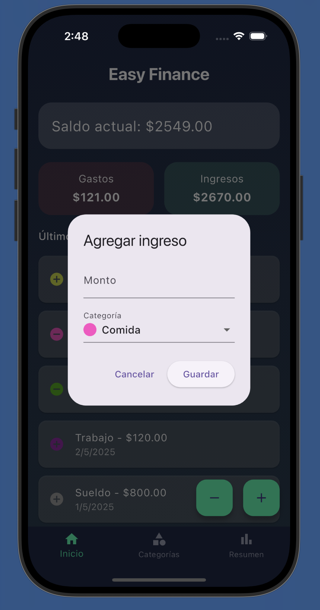
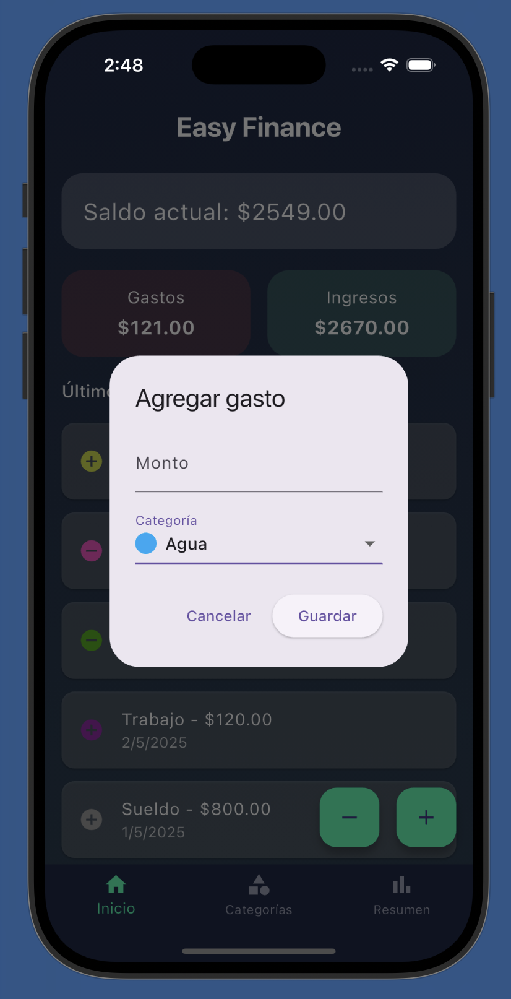
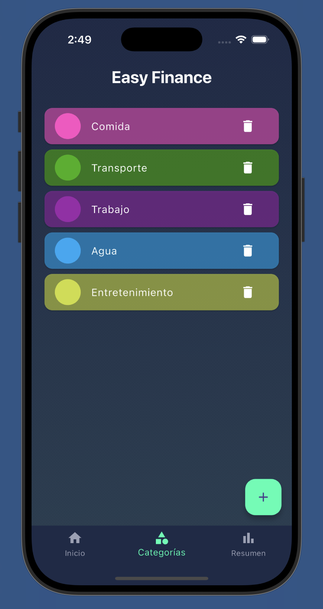
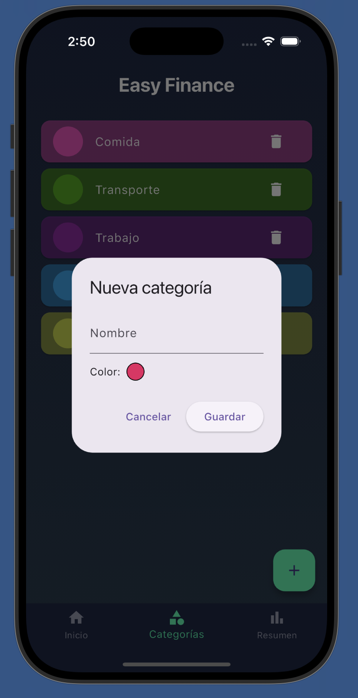
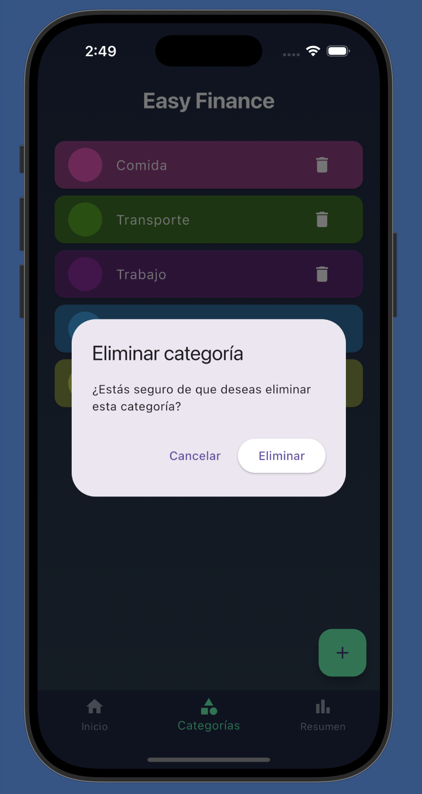
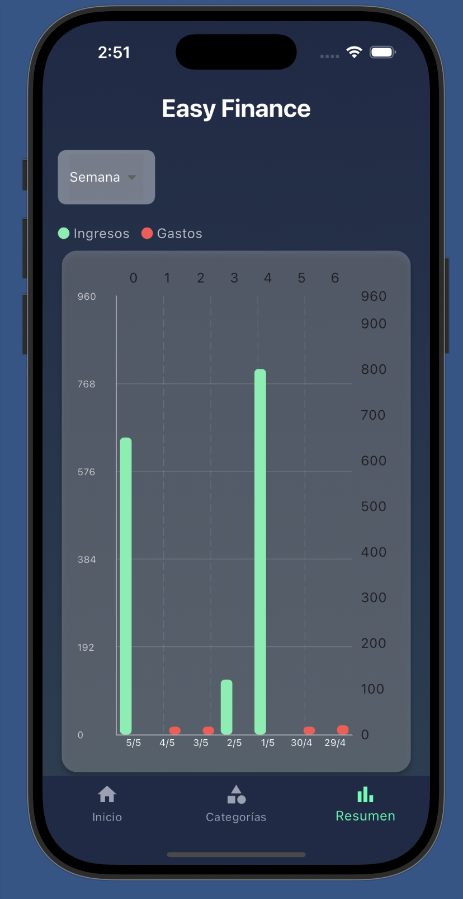

# Easy Finance

**Easy Finance** es una aplicación móvil desarrollada en Flutter para gestionar tus finanzas personales de forma sencilla e intuitiva. Permite registrar ingresos y gastos, organizar categorías y visualizar un resumen gráfico de tu actividad financiera.

---

## 📖 Descripción

- **Registrar movimientos** de ingresos y gastos.  
- **Categorías** personalizables (Comida, Transporte, Trabajo, etc.), cada una con color propio.  
- **Resumen gráfico** con barras que muestran ingresos y gastos por día, semana, mes o año.  
- **Persistencia local**: los datos se guardan en archivos JSON para mantener tu información aun al cerrar la app.

---

## 🚀 Cómo correr la aplicación

1. Clona este repositorio:

    ```bash
    git clone https://github.com/tu_usuario/easy_finance.git
    cd easy_finance
    ```

2. Instala las dependencias de Flutter:

    ```bash
    flutter pub get
    ```

3. Corre la app en un dispositivo o emulador:

    ```bash
    flutter run
    ```

> **Nota:** Asegúrate de tener instalado **Flutter SDK (>= 3.0.0)** y configurado tu emulador iOS/Android.

---

## 📸 Capturas de pantalla

<details>
<summary><strong>Movimientos</strong></summary>

<table>
<tr>
  <th>Acción</th>
  <th>Imagen</th>
</tr>
<tr>
  <td>Agregar Ingreso</td>
  <td></td>
</tr>
<tr>
  <td>Agregar Gasto</td>
  <td></td>
</tr>
</table>

</details>

<details>
<summary><strong>Categorías</strong></summary>

<table>
<tr>
  <th>Pantalla</th>
  <th>Imagen</th>
</tr>
<tr>
  <td>Lista de Categorías</td>
  <td></td>
</tr>
<tr>
  <td>Nueva Categoría</td>
  <td></td>
</tr>
<tr>
  <td>Eliminar Categoría</td>
  <td></td>
</tr>
</table>

</details>

<details>
<summary><strong>Resumen Gráfico</strong></summary>

<p align="center">
  
</p>

*Gráfico de barras de ingresos y gastos.*

</details>

---

## 🛠️ Estructura de carpetas

```
easy_finance/
├─ assets/
│  └─ Screenshots/
│  └─ Data/
├─ lib/
│  ├─ models/         # Modelos de datos
│  ├─ services/       # Servicios para el manejo de json
│  ├─ pages/          # Páginas: Home, Categorías, Resumen
│  └─ widgets/        # Componentes reutilizables
└─ pubspec.yaml       # Configuración de Flutter y assets
```

---

¡Listo! Ya tienes todo para empezar a usar y contribuir en **Easy Finance**.

